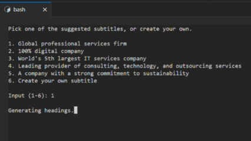
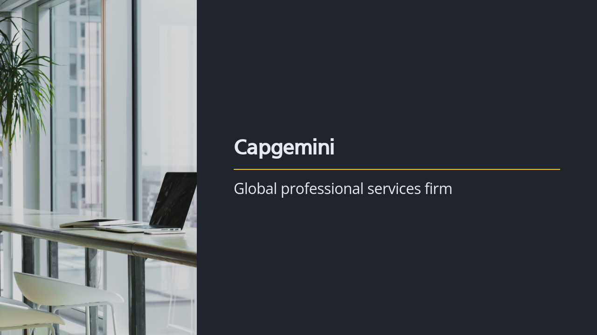
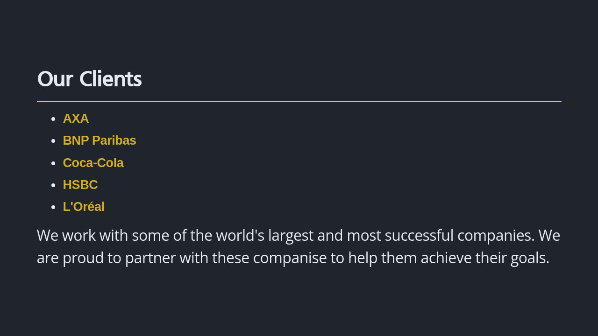

# Presentation Deck Generator

## By HK Olympic Team

GenAI Hackathon 2023 

https://capgemini.genai.onova.io/

## Screenshots








## Prequisite

1. Developed and tested on linux system only
2. gcloud CLI ([Installation🔗](https://cloud.google.com/sdk/docs/install), [authorization🔗](https://cloud.google.com/sdk/docs/authorizing))
2. Docker / Docker compose 
3. Python3 / pip3 / venv

## Setup

1. Get access key for unsplash, and place it in [slides/unsplash.py](slides/unsplash.py) line #6. ([Documentation🔗](https://cloud.google.com/sdk/docs/install).
2. Setup python venv and install dependencies by running

    ```console
    $ ./setup.sh
    ```

    or 

    ```console
    $ docker image pull marpteam/marp-cli
    $ python3 -m venv venv
    $ source venv/bin/activate
    (venv) $ python3 -m pip install -r requirements.txt
    ```

## Run the application

```console
$ ./run.sh
```

or 

```console
$ source ./venv/bin/activate
(venv) $ python3 app.py
```

## Tips

At current version, the application will perform better with a more generic topic, e.g. "Docker", instead over "Docker Crash Course for Absolute Beginners". The direction of the topic can be set in the subtitle.